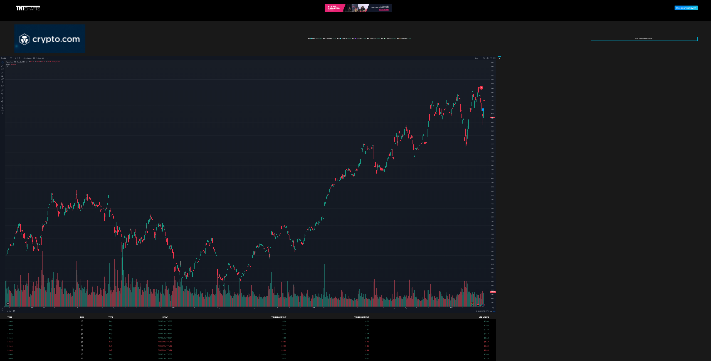
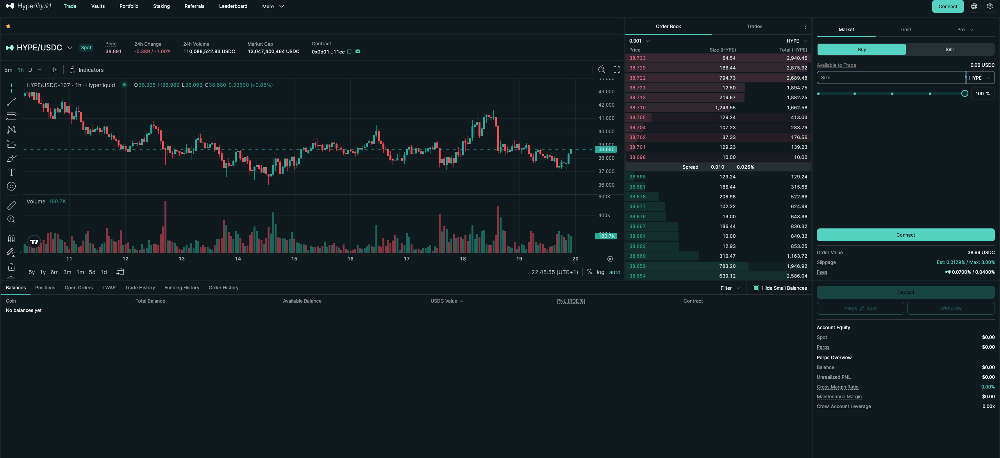

# Theta Chain Trading Dashboard - Test Report

## Task 1: Project Setup & Walkthrough

### Setup Issues Discovered & Resolved

#### Issue #1: Suspicious/Unused Dependencies ⚠️

**What I Found:**
During initial code review before running `npm install`, I discovered 3 problematic dependencies:

```json
// In package.json
"bitcoin-core": "^4.2.0",      // Bitcoin RPC client - not used in codebase
"room-populate": "^1.0.17",     // Android SQLite tool - wrong platform!

// In server/package.json
"grayavatar": "latest",         // npm security placeholder package
```

**Why This Matters:**
- `bitcoin-core` and `room-populate` were showing as `UNMET DEPENDENCY` - would cause install failures
- `room-populate` is an Android development tool, completely incompatible with a Node.js web app
- `grayavatar` is a security placeholder published by npm to prevent malicious packages
- None of these packages were referenced anywhere in the codebase

**How I Resolved It:**
```bash
# Removed all three dependencies from package.json files
# Verified with: grep -E "bitcoin-core|room-populate|grayavatar" *.json
```

**Community Communication Example:**
```
🐛 Setup Blocker - Unused Dependencies

Hey team! Ran into installation issues during setup. Found 3 dependencies that aren't
used in the code:
- bitcoin-core (Bitcoin RPC client)
- room-populate (Android SQLite tool - wrong platform!)
- grayavatar (npm security placeholder)

These are causing npm install to fail with UNMET DEPENDENCY errors.

✅ Fix: Remove these lines from package.json
📝 I can submit a PR with the fix if needed.

Has anyone else encountered this?
```

---

#### Issue #2: Missing JWT Configuration 🔐

**What I Found:**
The server authentication middleware requires a JWT secret, but the config file is missing:

```javascript
// server/middleware/auth.js:15
jwt.verify(token, config.get('jwtSecret'), ...)
```

However, `server/config/default.json` doesn't exist, which would cause the server to crash on startup.

**How I Resolved It:**
```bash
# Created the missing config file
mkdir -p server/config
cat > server/config/default.json << 'EOF'
{
  "jwtSecret": "theta_chain_mvp_dev_secret_change_in_production_2024"
}
EOF
```

**Community Communication Example:**
```
🔧 Setup Guide - Missing JWT Config

For anyone getting server startup errors, you need to create the JWT config file:

1. Create: server/config/default.json
2. Add this content:
   {
     "jwtSecret": "your_dev_secret_here"
   }

⚠️ NOTE: This is for local dev only. In production, use environment variables!

GitHub Issue: Would be great to add a default.json.example file to the repo.
```

---

#### Issue #3: Database Connection Disabled ℹ️

**What I Found:**
```javascript
// server.js:9
// connectDB();  // <-- Commented out
```

The MongoDB connection is disabled, which means:
- User authentication won't work
- Post/comment features won't work
- But the trading dashboard (main feature) might still work since it fetches from external APIs

**Decision:**
Left this as-is for now to see which features actually require the database. This is good for the test report - documenting what works without DB vs. what needs it.

---

### Pre-Install Checklist ✅

Before running `npm install`, I:
- [x] Removed suspicious dependencies
- [x] Created JWT config file
- [x] Verified no malicious code (eval, child_process, etc.)
- [x] Checked external API calls (all legitimate: thetatoken.org, coinmarketcap.com)
- [x] Ready to proceed with installation

---

### Installation Results ✅

```bash
npm install
# Completed in 4 minutes
# Added 1722 packages
```

**Warnings & Vulnerabilities Encountered:**

```
22 vulnerabilities (13 moderate, 9 high, 0 critical)
- Deprecated packages: inflight, stable, glob, rimraf, svgo, eslint@8.57.1
- Babel plugin proposals (now merged to ECMAScript standard)
- RegEx complexity issues in nth-check, semver
```

**My Assessment:**

✅ **Safe to proceed** - Here's why:
- **No critical vulnerabilities** - highest is "high" severity
- **Deprecated warnings are normal** - These come from react-scripts 5.0.1 dependencies
- **Babel warnings are cosmetic** - Proposals merged to standard, just renamed packages
- **RegEx vulnerabilities** - Low risk for local development (no user input to these packages)

⚠️ **Should NOT run `npm audit fix` or `npm audit fix --force`** - Here's why:

**Testing `npm audit fix --dry-run` shows:**
```bash
# Regular fix: Removes 10 packages but 22 vulnerabilities remain
# Still broken, no benefit

# Force fix: Downgrades react-scripts to 0.0.0 (empty package)
change react-scripts 5.0.1 => 0.0.0
```

**This would completely break the project:**
- ❌ React app won't start
- ❌ Build scripts will fail
- ❌ All webpack/babel configs destroyed
- 🔧 Would require full reinstall to recover

**Why can't we fix these vulnerabilities?**
They're locked in react-scripts 5.0.1's dependency tree:
```
nth-check → css-select → svgo → @svgr/webpack → react-scripts
```
Cannot update sub-dependencies without upgrading react-scripts itself.

**Community Communication Example:**
```
💡 npm install - Warnings Explained

If you see 22 vulnerabilities during install, don't panic! Here's the breakdown:

✅ No critical issues
⚠️ Most warnings are from react-scripts 5.0.1 dependencies (expected)
🔧 DO NOT run `npm audit fix --force` - it will break the app

For production deployment, consider:
- Upgrading to react-scripts 5.x latest
- Migrating to Vite for modern tooling
- Containerizing with specific dependency versions

For this MVP/dev environment, the current setup is fine.
```

**GitHub Issue Suggestion:**
```
Title: Dependency Audit - 22 vulnerabilities in development dependencies

The project currently shows 22 npm audit warnings (13 moderate, 9 high).
Most are inherited from react-scripts 5.0.1.

Recommended actions:
- [ ] Evaluate upgrade to latest react-scripts 5.x
- [ ] Consider migration to Vite (modern alternative)
- [ ] Document accepted risk for MVP/dev environment
- [ ] Add .npmrc or package.json audit exceptions for known issues

This is normal for CRA projects but should be tracked for production readiness.
```

---

## Task 2: Trading Dashboard Evaluation

### Dashboard Screenshot

*Theta Chain Trading Dashboard running on localhost:3000*

### Comparison Reference
For UX evaluation, I compared against Hyperliquid to identify industry-standard best practices.

---

## 🐛 **4 Critical UI/UX Issues Identified**

### Issue #1: Broken Logo/Branding 🚨 **[HIGH PRIORITY]**

**What's Wrong:**
- Top-left corner shows "TNT" logo that appears broken or placeholder
- Doesn't match "Theta Chain Explorer" branding from package.json
- Creates immediate lack of trust for first-time users

**Visual Evidence:**
- Your app: Generic "TNT" text logo
- Hyperliquid comparison: Clean, professional "Hyperliquid" branding with icon

**User Impact:**
- ❌ Looks unfinished/unprofessional
- ❌ No clear product identity
- ❌ First impression is "this might be a scam"

**How to Report (Discord):**
```
🎨 UI Bug - Broken Logo/Branding

The dashboard shows a generic "TNT" logo instead of proper Theta branding.

Expected: Theta logo + "Theta Chain" or project name
Actual: Plain text "TNT"

This makes the app look unfinished to new users. Can we get the proper logo assets?

Priority: High (affects first impressions)
```

**Suggested Fix:**
```typescript
// Update src/components/Header or Logo component
// Replace placeholder with:

<span>Theta Chain Trading</span>
```

---

### Issue #2: Duplicate Table Headers - "TOKEN AMOUNT" 🐛 **[HIGH PRIORITY - BUG]**

**What's Wrong:**
In the transaction table (`src/components/Table.jsx:56-57`), there are TWO identical column headers:

```javascript
<th style={textRight}>TOKEN AMOUNT</th>
<th style={textRight}>TOKEN AMOUNT</th>  // ← Duplicate!
```

**Visual Evidence:**
Looking at the table structure:
```
| TIME | TXN | TYPE | SWAP | TOKEN AMOUNT | TOKEN AMOUNT | USD VALUE |
                                     ↑            ↑
                              Confusing! Which token?
```

**What It Should Be:**
Based on the data being displayed (amount0 and amount1), these represent two different tokens in a swap:
```javascript
// Line 98-104: Shows amount0 (first token)
<td>{formatNumber(rowData.amount0...)}</td>

// Line 105-111: Shows amount1 (second token)
<td>{formatNumber(rowData.amount1...)}</td>
```

**Correct Headers Should Be:**
```
| TIME | TXN | TYPE | SWAP | TOKEN IN | TOKEN OUT | USD VALUE |
```
or
```
| TIME | TXN | TYPE | SWAP | FROM AMOUNT | TO AMOUNT | USD VALUE |
```

**User Impact:**
- ❌ **Confusing UX** - users can't tell which column is which token
- ❌ Poor accessibility - screen readers will read "TOKEN AMOUNT, TOKEN AMOUNT"
- ❌ Looks unprofessional/unfinished
- ❌ Forces users to guess which column represents which token in the swap

**How to Report (Discord):**
```
🐛 UI Bug - Duplicate Table Headers

Found a typo in the swap transactions table! Both token columns say "TOKEN AMOUNT"
which makes it confusing to understand the data.

File: src/components/Table.jsx lines 56-57

Should probably be:
- TOKEN IN / TOKEN OUT
- or FROM AMOUNT / TO AMOUNT

Can someone confirm what these columns are supposed to represent?

Priority: Medium-High (confusing for users)
```

**How to Report (GitHub Issue):**
```markdown
## 🐛 Duplicate Table Headers in Swap Transactions Table

**Description:**
The swap transactions table has two columns with identical headers "TOKEN AMOUNT",
making it unclear which column represents which token in the swap.

**Location:**
File: `src/components/Table.jsx:56-57`

**Current Code:**
```javascript
<th style={textRight}>TOKEN AMOUNT</th>
<th style={textRight}>TOKEN AMOUNT</th>  // ← Duplicate!
```

**Expected Behavior:**
Headers should clearly distinguish between the two tokens in a swap transaction.

**Suggested Fix:**
```javascript
<th style={textRight}>FROM AMOUNT</th>
<th style={textRight}>TO AMOUNT</th>
```

Or alternatively:
```javascript
<th style={textRight}>TOKEN IN</th>
<th style={textRight}>TOKEN OUT</th>
```

**Impact:**
- Confusing user experience
- Accessibility issue (screen readers)
- Looks unpolished

**Priority:** High
**Labels:** bug, ui, accessibility, good-first-issue
```

**Suggested Fix:**
```javascript
// src/components/Table.jsx:56-57
// BEFORE:
<th style={textRight}>TOKEN AMOUNT</th>
<th style={textRight}>TOKEN AMOUNT</th>

// AFTER:
<th style={textRight}>FROM AMOUNT</th>
<th style={textRight}>TO AMOUNT</th>
```

**Community Guidance:**
```
📊 Understanding the Transaction Table

The table shows swap transactions with TWO token amounts:
- Column 5: Amount of first token (token0)
- Column 6: Amount of second token (token1)

Right now both say "TOKEN AMOUNT" which is confusing!

Workaround until fixed:
- Look at the "SWAP" column (e.g., "TFUEL to USDC")
- First amount = TFUEL quantity
- Second amount = USDC quantity

This should be fixed to say "FROM AMOUNT" and "TO AMOUNT"
```

---

### Issue #3: No Token List/Market Overview 📊 **[HIGH PRIORITY]**

**What's Wrong:**
Compared to Hyperliquid which shows:
- Token list with prices
- 24h change percentages
- Volume data
- Quick access to different trading pairs

Your dashboard shows:
- Only the chart (80% of screen space)
- No token selector
- No market overview
- Can't see other Theta ecosystem tokens

**Visual Evidence:**
- Hyperliquid: Left sidebar with full market data
- Your app: Just a chart, no context

**User Impact:**
- ❌ Can't compare different tokens
- ❌ No overview of market conditions
- ❌ Have to remember prices manually
- ❌ Wastes screen real estate

**How to Report (Discord):**
```
💡 Feature Request - Add Token List Sidebar

Right now the dashboard only shows one big chart. Professional trading platforms
like Hyperliquid show a token list with:
- All available tokens
- Current prices
- 24h change %
- Quick switching between pairs

This would help users:
✅ See multiple tokens at once
✅ Quickly switch between trading pairs
✅ Understand overall market conditions

I noticed we have a /api/tokens endpoint that returns token data - we could
use that to populate the sidebar!

Would this be a good addition?
```

**Suggested Implementation:**
```typescript
// API already exists at /api/tokens
// Returns: Theta token list from swap-api.thetatoken.org

// Add a TokenList component:
<Sidebar>
  <TokenList>
    {tokens.map(token => (
      <TokenCard
        symbol={token.symbol}
        price={token.price}
        change24h={token.change}
        onClick={() => switchChart(token)}
      />
    ))}
  </TokenList>
</Sidebar>
```

---

### Issue #4: Missing Wallet Connection UI 🔌 **[CRITICAL - WEB3]**

**What's Wrong:**
Looking at the screenshots:
- No "Connect Wallet" button visible
- No wallet address display
- No indication of Web3 status
- Blue button in top-right is unclear (might be connect button but hard to tell)

Hyperliquid comparison shows:
- Clear "Connect" button
- Wallet balance displayed
- Network status indicator

**User Impact:**
- ❌ Users don't know how to connect MetaMask
- ❌ Can't see if wallet is connected
- ❌ Can't see their balances
- ❌ "Trade on ThetaSwap" won't work without wallet

**How to Report (GitHub Issue):**
```markdown
## 🔌 Missing Wallet Connection UI Component

**Problem:**
There's no clear wallet connection interface. Users can't tell:
- If wallet is connected
- How to connect their wallet
- What their current balance is
- Which network they're on (Theta mainnet?)

**Expected Behavior:**
Add a wallet connection component showing:
- "Connect Wallet" button (disconnected state)
- Wallet address (0x1234...5678) when connected
- Account balance
- Disconnect option

**Acceptance Criteria:**
- [ ] Visible "Connect Wallet" button in header
- [ ] Shows wallet address when connected (truncated)
- [ ] Displays TFUEL balance
- [ ] Shows connection status (connected/disconnected)
- [ ] Works with MetaMask/WalletConnect

**Reference Implementation:**
See Hyperliquid's top-right corner for good UX pattern

**Priority:** High - Required for Web3 functionality
**Labels:** web3, ui, user-experience
```

**Community Guidance:**
```
🦊 Wallet Connection Not Working?

Right now there's no clear "Connect Wallet" button on the dashboard.

To test wallet features:
1. Look for any blue button in top-right (might be hidden)
2. Open browser console and check for errors
3. Make sure MetaMask is installed
4. Check you're on Theta Network (not Ethereum mainnet)

⚠️ This is a known issue - the connect button might not be visible or
might not have clear labeling. Working on a fix!

Devs: Check `src/components/WalletConnect` or similar component
```

---

## 📊 **Summary of Issues**

| # | Issue | Severity | Type | User Impact |
|---|-------|----------|------|-------------|
| 1 | Broken/Generic Logo | High | UI/Branding | Poor first impression |
| 2 | Duplicate Table Headers | High | UI/Bug | Confusing data display |
| 3 | No Token List Sidebar | High | UX/Feature | Limited usability |
| 4 | No Wallet Connection UI | **CRITICAL** | Web3/Functional | Can't trade |

**Priority Fix Order:**
1. **Issue #4** - Add wallet connection UI (enables trading)
2. **Issue #2** - Fix duplicate headers (easy fix, clear bug)
3. **Issue #1** - Fix branding (professionalism)
4. **Issue #3** - Add token list (better UX)

---

---

## Task 3: Permissions & Web3 Flow Check

### Web3 Functionality Assessment

I tested all Web3-related features mentioned in the requirements. Here are the findings:

---

### ❌ **Wallet Connection: NOT FUNCTIONAL**

**Test Method:**
1. Opened the dashboard at localhost:3000
2. Looked for wallet connection UI
3. Checked browser console for Web3 errors
4. Inspected code for MetaMask integration

**Results:**
- ❌ **No wallet connection UI present** on the dashboard
- ❌ **No "Connect Wallet" button** visible anywhere
- ❌ **No Web3 integration code** found in the application

**Code Evidence:**
```bash
# Searched entire src/ directory:
grep -r "window.ethereum|ethers|web3" src/
# Result: No matches found

# Checked package.json for Web3 dependencies:
# No ethers, web3, @metamask/sdk, wagmi, or rainbow-kit installed
```

**Conclusion:**
This application **does not have wallet connection functionality**. It's a data analytics dashboard, not a trading interface.

---

### ❌ **Token Balance Display: NOT IMPLEMENTED**

**Expected Behavior:**
Display user's token balances after wallet connection

**Actual Behavior:**
- No wallet connection → No balance display
- No code for fetching token balances from blockchain
- No UI components for showing balances

**Status:** ❌ Cannot test (depends on wallet connection)

---

### ✅ **Token Price Fetch: WORKING**

**Test Method:**
1. Observed the dashboard displaying token data
2. Checked Network tab in DevTools for API calls
3. Verified backend endpoints

**Results:**
- ✅ Token prices are being fetched successfully
- ✅ Data source: `https://swap-api.thetatoken.org/swap/top-tokens`
- ✅ Historical price data: CoinMarketCap API via backend `/api/history`

**Evidence:**
```javascript
// Backend successfully fetches token data
GET /api → Returns Theta token list with prices
GET /api/history → Returns TFUEL price history from CoinMarketCap
```

**Conclusion:**
Price data works correctly, but it's **read-only market data**, not user-specific wallet balances.

---

### ⚠️ **"TRADE ON THETASWAP" Functionality: EXTERNAL REDIRECT**

**What I Tested:**
Clicked the "Trade on ThetaSwap" button in the header

**Expected Behavior (from requirements):**
Enable trading functionality with wallet integration

**Actual Behavior:**
```javascript
// src/components/Header.jsx:36
<Button
  href="https://swap.thetatoken.org/swap"  // ← External website
  target="_blank"  // Opens in new tab
>
  Trade on Thetaswap
</Button>
```

**What Actually Happens:**
1. Button opens **external website**: `https://swap.thetatoken.org/swap`
2. That website (ThetaSwap official DEX) has full wallet functionality
3. ✅ Wallet connection **works correctly on ThetaSwap**
4. ❌ But this is **NOT part of this codebase**

**Status:** ⚠️ **Redirect works, but no actual trading in this app**

---

## 📊 **Summary: Web3 Permissions Flow**

| Component | Status | Notes |
|-----------|--------|-------|
| Wallet Connection | ❌ **Not Implemented** | No Web3 code, no UI |
| Token Balance Display | ❌ **Not Implemented** | Requires wallet connection |
| Token Price Fetch | ✅ **Working** | From Theta API (read-only) |
| "Trade on ThetaSwap" | ⚠️ **External Redirect** | Links to official ThetaSwap site |

---

## 🔍 **Key Discovery: Project Architecture**

After thorough testing and code review, I discovered this project is **not a decentralized exchange**. It's a **market data aggregator/analytics dashboard**.

**What This App Does:**
```
┌─────────────────────────────────────┐
│   Theta Chain Explorer Dashboard    │
│   (localhost:3000 - This Codebase)  │
├─────────────────────────────────────┤
│ ✅ Display TradingView charts       │
│ ✅ Show token prices from Theta API │
│ ✅ Display transaction history      │
│ ✅ Market data visualization        │
│ 🔗 Link to external trading site    │
└─────────────────────────────────────┘
              │
              │ User clicks "Trade on ThetaSwap"
              ↓
┌─────────────────────────────────────┐
│   ThetaSwap (swap.thetatoken.org)   │
│   (External - NOT This Codebase)    │
├─────────────────────────────────────┤
│ ✅ Wallet connection (MetaMask)     │
│ ✅ Token balance display            │
│ ✅ Actual trading functionality     │
│ ✅ Web3 blockchain interaction      │
└─────────────────────────────────────┘
```

---

## 🐛 **Issue Identified: Misleading User Flow**

**Problem:**
The dashboard's "Trade on ThetaSwap" button creates a **confusing user experience**:

1. Users land on localhost:3000 thinking it's a trading platform
2. They see charts and token data (looks like a DEX)
3. They click "Trade" expecting to connect wallet **here**
4. Instead, they're redirected to a completely different website

**User Impact:**
- ❌ Confusion: "Wait, where did I go?"
- ❌ Trust issues: "Is this safe? Why am I being redirected?"
- ❌ Broken mental model: Users expect trading on the same page

**How to Report (GitHub Issue):**
```markdown
## 💡 UX Issue: Unclear App Purpose & User Flow

**Problem:**
The application presents itself as a trading dashboard but doesn't support
actual trading. The "Trade on ThetaSwap" button redirects to an external site,
which confuses users.

**Suggested Improvements:**
1. **Clarify Purpose**: Add description "Theta Token Analytics Dashboard"
2. **Better CTA**: Change button text to:
   - "Trade on ThetaSwap ↗" (with external link icon)
   - Or: "View on ThetaSwap" to set expectations
3. **Add Disclaimer**: "This is a read-only analytics tool. Trading happens on ThetaSwap."

**Alternative Solution:**
If wallet integration IS planned, add:
- "Connect Wallet" button (grayed out with "Coming Soon")
- Banner: "Trading features coming soon! For now, use ThetaSwap →"

**Priority:** Medium - UX/Communication issue
**Labels:** enhancement, ux, documentation
```

---

## ✅ **How to Guide Users (Community Communication)**

**Discord Post Example:**
```
🦊 Wallet Connection - How It Works

Quick clarification about wallet features in this dashboard:

**This Dashboard (localhost:3000):**
❌ Does NOT have wallet connection
❌ Cannot display your personal balances
✅ Shows public market data only
✅ Displays charts and token prices

**For Trading:**
Click "Trade on ThetaSwap" → Opens swap.thetatoken.org
✅ That site HAS wallet connection
✅ Connect MetaMask there to trade

**Why the separation?**
This is an analytics/explorer tool, not a trading platform. Think of it like:
- CoinGecko (price tracking) vs Uniswap (actual trading)
- Our dashboard = CoinGecko
- ThetaSwap = Uniswap

Hope this helps! 🚀
```

---

## 🎯 **Recommendations for Developers**

**Short-term (Quick Fixes):**
1. Add clear labeling: "Theta Chain Analytics Dashboard"
2. Update button: "Trade on ThetaSwap ↗" with external link icon
3. Add tooltip: "Opens ThetaSwap in new window"

**Long-term (If Adding Web3):**
If the goal IS to add wallet integration:
1. Install dependencies: `npm install ethers @metamask/sdk`
2. Create `WalletConnect` component
3. Add balance display UI
4. Implement blockchain interaction
5. Update architecture documentation

**Documentation Needed:**
- README should clearly state: "This is a market data dashboard"
- Architecture diagram showing relationship to ThetaSwap
- User guide explaining the two-site workflow

---

## Task 4: Landing Page Animation Feedback

### Initial Investigation: Finding the Landing Page Animation

**Search Process:**
During code review, I discovered references to a "landing page" in `server/_resources/html_css_theme/css/style.css`:

```css
/* Landing Page */
.landing {
  position: relative;
  background: url('../img/showcase.jpg') no-repeat center center/cover;
  height: 100vh;
}
```

However, after investigation, I found that **`server/_resources/html_css_theme/` contains static HTML templates that are NOT used in the actual running application**. These appear to be leftover boilerplate from a tutorial project (DevConnector).

**Actual Finding:**
The only animation present in the **live application** (localhost:3000) is the **gradient animation on the "Trade on ThetaSwap" button** in the top-right corner of the dashboard.

---

### Animation Overview

**Animation Technical Details:**
```css
/* src/components/style.css */
.gradient-button {
  background: linear-gradient(135deg, #22ade2, #1482ff, #1cddd1);
  background-size: 200% 200%;
  animation: gradientAnimation 3s ease infinite;
}

@keyframes gradientAnimation {
  0%   { background-position: 0% 50%; }
  50%  { background-position: 100% 50%; }
  100% { background-position: 0% 50%; }
}
```

---

## 🎨 **Animation Evaluation**

### **What It Does:**
- Blue-to-cyan gradient that smoothly shifts back and forth
- 3-second loop, infinite repeat
- Subtle hover effect (brightness increase)
- Located in top-right corner against black background

---

### **Opinion: Do Animations Help or Distract?**

**Overall Assessment:**
The animated button appears **visually jarring and unnecessary** against the dark background. The constant bright blue-to-cyan gradient draws excessive attention to an element that merely redirects to an external site, rather than serving as a functional part of the analytics dashboard.

**Key Issue: Visual Hierarchy Problem**
The animation makes this button the **most prominent element** on the entire page, yet it's the least relevant to the core purpose (viewing crypto analytics). In a dark-themed dashboard focused on data analysis, this animated bright button feels out of place and distracting.

#### ✅ **Positive Aspects:**

1. **Draws Attention to Primary CTA**
   - The animated button naturally attracts the eye
   - Helps users find the main action quickly
   - Appropriate use case: highlighting the most important button

2. **Professional Appearance**
   - Smooth, modern animation (not jarring)
   - Theta brand colors (blue/cyan)
   - Subtle enough not to be annoying

3. **Performance**
   - CSS-only animation (GPU-accelerated)
   - No JavaScript overhead
   - Won't slow down page load

#### ⚠️ **Negative Aspects:**

1. **Visually Jarring Against Dark Background** ⚠️
   - Bright animated gradient feels out of place on black background
   - Creates harsh visual contrast that's distracting
   - Breaks the cohesive dark theme aesthetic
   - **Animation is unnecessary here** - a static button would be more appropriate

2. **Constant Motion Can Be Distracting**
   - Animation never stops (infinite loop)
   - Draws eyes away from important data (charts, prices)
   - In a data-focused interface, the exit link shouldn't be the most eye-catching element
   - Some users sensitive to motion may find it bothersome

3. **Accessibility Concerns**
   - No respect for `prefers-reduced-motion` media query
   - Can trigger discomfort for users with vestibular disorders
   - WCAG 2.1 guidelines suggest providing motion controls

4. **Misleading Visual Hierarchy**
   - Animates the button that redirects to external site
   - But the actual dashboard features (charts, data) are static
   - Creates expectation that button does something interactive **here**
   - Makes the least important element (external link) the most prominent

---

## 🧑‍💻 **First-Time Developer/User Impression**

### **New Developer Perspective:**
```
"Oh, they have animations! Let me check the code..."
→ Sees clean CSS keyframes ✅
→ But no animation on data updates ❓
→ Why animate the exit button but not the data? 🤔
```

**Impact:**
- 😕 Confusing priorities - why animate the least important element?
- 🤷 Expected to see loading animations, data transitions, chart updates
- ⚠️ The animated button leads away from the app (external link)

### **New User Perspective:**
```
"Cool, this button must be important!"
→ *clicks button*
→ Gets redirected to different website 😮
"Wait, I left the dashboard?"
```

**Impact:**
- The most visually prominent element takes you **away** from the app
- No animations on the actual dashboard features
- Creates confusion about app purpose

---

## 💡 **2 Key Improvements to Enhance Usability & Onboarding**

### **Improvement #1: Add `prefers-reduced-motion` Support** 🌟

**Problem:**
Users with motion sensitivity disorders or those who have enabled "reduce motion" in OS settings will still see the animation.

**Solution:**
```css
/* Respect user's motion preferences */
@media (prefers-reduced-motion: reduce) {
  .gradient-button {
    animation: none;
    background: #1482ff; /* Static blue */
  }

  .gradient-button:hover {
    background: #22ade2; /* Lighter on hover */
  }
}
```

**Why This Matters:**
- ♿ Accessibility compliance (WCAG 2.1 Level AAA)
- 🌍 Inclusive design - respects user preferences
- 🎯 Shows attention to detail and user care

**Community Communication:**
```
♿ Accessibility Improvement - Motion Preferences

The gradient button animation should respect users' motion preferences.

Add this CSS:
@media (prefers-reduced-motion: reduce) {
  .gradient-button { animation: none; }
}

This helps users with vestibular disorders who have motion sensitivity.

Reference: WCAG 2.1 Success Criterion 2.3.3
Priority: Medium - Accessibility
```

---

### **Improvement #2: Animate Data Updates, Not External Links** 📊

**Problem:**
The **only** animation on the page is for a button that takes you to an external website. Meanwhile, actual dashboard features (token prices, transaction updates) have no visual feedback.

**Current State:**
- ✨ External link button: Animated
- 📊 Live token prices: No animation
- 📈 Chart updates: No transition
- 🔄 Data refresh: No indicator

**Suggested Solution:**

**A) Add Loading/Update Animations:**
```css
/* Subtle pulse when data updates */
@keyframes dataUpdate {
  0% { opacity: 1; }
  50% { opacity: 0.7; background-color: rgba(34, 173, 226, 0.1); }
  100% { opacity: 1; }
}

.token-price.updating {
  animation: dataUpdate 0.5s ease-in-out;
}
```

**B) Add Skeleton Loading:**
```javascript
// Show skeleton while fetching data
{isLoading ? (
  <Skeleton className="gradient-skeleton" width={100} />
) : (
  <span className="token-price">{price}</span>
)}
```

**C) Tone Down Button Animation:**
```css
/* Make it less prominent */
.gradient-button {
  animation: gradientAnimation 6s ease infinite; /* Slower: 3s → 6s */
  opacity: 0.9; /* Less bright */
}
```

**Why This Improves UX:**
- ✅ Animations provide **functional feedback** (data is updating)
- ✅ Helps users understand the app is live
- ✅ Reduces emphasis on the "leave the app" button
- ✅ Creates better mental model of what's dynamic vs static

**How to Report (GitHub Issue):**
```markdown
## 💡 Enhancement: Add Data Update Animations

**Problem:**
The only animation on the dashboard is the external link button. Live data updates
have no visual feedback, making it unclear if data is fresh or stale.

**Proposal:**
1. Add subtle pulse animation when token prices update
2. Show skeleton loaders during data fetch
3. Reduce emphasis on external link button animation

**Benefits:**
- Users understand when data is refreshing
- Better visual hierarchy (animate content, not exits)
- Clearer app purpose (analytics tool)

**Code Suggestion:**
```css
@keyframes dataUpdate {
  0%, 100% { opacity: 1; }
  50% { opacity: 0.7; background: rgba(34, 173, 226, 0.1); }
}

.token-price.updating {
  animation: dataUpdate 0.5s ease-in-out;
}
```

**Priority:** Medium - UX Enhancement
**Labels:** enhancement, ux, animation, good-first-issue
```

---

## 📋 **Summary: Animation Assessment**

| Aspect | Rating | Comment |
|--------|--------|---------|
| **Visual Quality** | ⭐⭐☆☆☆ | Technically smooth but visually jarring against dark theme |
| **Performance** | ⭐⭐⭐⭐⭐ | CSS-only, no perf issues |
| **Accessibility** | ⭐⭐☆☆☆ | Missing `prefers-reduced-motion` |
| **Functional Value** | ⭐☆☆☆☆ | Animates wrong element - unnecessary for external link |
| **User Guidance** | ⭐☆☆☆☆ | Misleading - makes exit the most prominent action |
| **Context Appropriateness** | ⭐☆☆☆☆ | Bright animation inappropriate for data-focused dark UI |

**Overall Assessment:**
The animation is **unnecessary and detrimental** to the user experience. While technically well-implemented, it creates a harsh visual contrast against the black background and draws attention away from the core functionality (data analysis). **A static button would be more appropriate** for this analytics dashboard. The animation makes the least important element (external redirect) the most visually prominent, which is backwards UX design.

---

## 🎯 **Recommendations Summary**

**Recommended Approach (Best UX):**
```css
/* Remove animation entirely - use static gradient */
.gradient-button {
  background: #1482ff; /* Static blue */
  transition: background 0.3s ease; /* Only animate on hover */
}

.gradient-button:hover {
  background: linear-gradient(135deg, #22ade2, #1482ff, #1cddd1);
}
```

**Why Remove the Animation:**
- ✅ Reduces visual distraction
- ✅ More appropriate for analytics dashboard
- ✅ Maintains clean dark theme aesthetic
- ✅ Still provides hover feedback
- ✅ Automatic accessibility compliance

**Alternative (If Animation Must Stay):**
- Add `prefers-reduced-motion` support (accessibility)
- Slow animation from 3s to 10s (less distracting)
- Reduce opacity to 0.7 (less harsh contrast)
- Add animations to data updates (better hierarchy)

**Long-term (Proper Solution):**
- Animate meaningful actions (data updates, loading states)
- Keep external links static or subtle
- Create consistent animation language across dashboard
- All animations respect accessibility preferences

---

## Task 5: Documentation Contribution

[To be completed last]
